## 函数式接口

 函数式接口就是一个接口中有且只有**一个**抽象方法,可以用**@FunctionalInterface**注解来代表该类是一个函数式接口

 接口中可以有抽象方法和非抽象方法(jdk1.8之后就可以在接口写方法体了，但是必须是被static或者是default修饰的)

#### Supplier接口

> java.util.function.Supplier<T> 接口仅包含一个无参的方法： T get() 。用来获取一个泛型参数指定类型的对 
>
> 象数据

```java
 public  static String getString(Supplier<String> func)
    {
        return func.get();
    }
 public  static Integer getMax(Supplier<Integer> func)
    {
        return func.get();
    }
public static void main(String[] args) {
        String str1="hello";
        String str2="world";
        System.out.println(getString(()->str1+str2));
  	  //输出helloworld
        int[] arr={1,2,34,55,55,3435};
       System.out.println(getMax(() -> {
            int max = arr[0];
            for (int i : arr) {
                if (i > max) {
                    max = i;
                }
            }
            return max;
        }));
    //输出3435
    }

```

#### Consumer接口

>java.util.function.Consumer<T> 接口则正好与Supplier接口相反，它不是生产一个数据，而是**消费**一个数据， 
>
>其数据类型由泛型决定。 
>
>Consumer 接口中包含抽象方法 void accept(T t) ，意为消费一个指定泛型的数据

```java
private static void consumeString(Consumer<String> function) {
        function.accept("测试1");
    }
  private static void consumeStringAndThen(Consumer<String> one, Consumer<String> two) {
        one.andThen(two).accept("Hello");
    }
 private static void printInfo(Consumer<String> one, Consumer<String> two, String[] array) {
        for (String info : array) {
            one.andThen(two).accept(info);
        }
    }
    public static void main(String[] args) {
        consumeString(s -> System.out.println(s));
        //输出：测试1
        consumeStringAndThen(s -> System.out.println(s.toUpperCase()), s -> System.out.println(s.toLowerCase()));
		//输出：
         //HELLO
		//hello
        printInfo(s -> System.out.print("姓名：" + s.split(",")[0]), s -> System.out.println("。性别：" + s.split(",")[1] + "。"), array);
		//输出：
         //姓名：迪丽热巴。性别：女。
		//姓名：古力娜扎。性别：女。
		//姓名：马尔扎哈。性别：男。
    }
```

#### Predicate接口

> 有时候我们需要对某种类型的数据进行判断，从而得到一个boolean值结果。这时可以使用 java.util.function.Predicate<T> 接口。 
>
> Predicate 接口中包含一个抽象方法： boolean test(T t) 。用于条件判断

Predicate默认实现了and，or和negate这三个方法，分别对应着&&,||,!

1. 既然是条件判断，就会存在与、或、非三种常见的逻辑关系。其中将两个 Predicate 条件使用“与”逻辑连接起来实 

现“**并且**”的效果时，可以使用default方法 and

2. 与 and 的“与”类似，默认方法 or 实现逻辑关系中的“**或**”

3. “与”、“或”已经了解了，剩下的“非”（取反）也会简单

```java
  private static void method1(Predicate<String> predicate) {
        boolean veryLong = predicate.test("HelloWorld");
        System.out.println("字符串很长吗：" + veryLong);
    }
    private static void method2(Predicate<String> one, Predicate<String> two) {
        boolean isValid = one.and(two).test("Helloworld");
        System.out.println("字符串符合要求吗：" + isValid);
    }
    private static void method3(Predicate<String> one, Predicate<String> two) {
        boolean isValid = one.or(two).test("Helloworld");
        System.out.println("字符串符合要求吗：" + isValid);
    }
    private static void method4(Predicate<String> predicate) {
        boolean veryLong = predicate.negate().test("HelloWorld");
        System.out.println("字符串很长吗：" + veryLong);
    }
    private static List<String> filter(String[] array, Predicate<String> one, Predicate<String> two) {
        List<String> list = new ArrayList<>();
        for (String info : array) {
            if (one.and(two).test(info)) {
                list.add(info);
            }
        }
        return list;
    }
    public static void main(String[] args) {
        method1(s -> s.length() > 5);
        //返回：字符串很长吗：true
        method2(s -> s.contains("H"), s -> s.contains("W"));
        //&& 返回：字符串符合要求吗：false
        method3(s -> s.contains("H"), s -> s.contains("W"));
        //|| 返回：字符串符合要求吗：true
        method4(s -> s.length() < 5);
        //! 返回：字符串很长吗：true
        String[] array = {"迪丽热巴,女", "古力娜扎,女", "马尔扎哈,男", "赵丽颖,女"};
        List<String> list = filter(array, s -> "女".equals(s.split(",")[1]), s -> s.split(",")[0].length() == 4);
        System.out.println(list);
        //返回：[迪丽热巴,女, 古力娜扎,女]
    }
```

#### Function接口

> java.util.function.Function<T,R> 接口用来根据一个类型的数据得到另一个类型的数据，前者称为前置条件， 
>
> 后者称为后置条件。
>
> Function 接口中有一个默认的 andThen 方法，用来进行组合操作
>
> Function 接口中最主要的抽象方法为： R apply(T t) ，根据类型T的参数获取类型R的结果。 

使用的场景例如：将 String 类型转换为 Integer 类型。

```java
private static void method1(Function<String, Integer> function) {
        Integer num = function.apply("10");
        System.out.println("String类型转为Integer类型：" + num.getClass());
    }
    private static void method2(Function<String, Integer> one, Function<Integer, Integer> two) {
        int num = one.andThen(two).apply("10");
        System.out.println(num + 20);
    }
    private static int getAgeNum(String str, Function<String, String> one, Function<String, Integer> two, Function<Integer, Integer> three) {
        /**
         * 1. 将字符串截取数字年龄部分，得到字符串；
         * 2. 将上一步的字符串转换成为int类型的数字；
         * 3. 将上一步的int数字累加100，得到结果int数字。
         */
        return one.andThen(two).andThen(three).apply(str);
    }
    public static void main(String[] args) {
        method1(s -> Integer.parseInt(s));
        //输出：String类型转为Integer类型：class java.lang.Integer
        method2(str -> Integer.parseInt(str) + 10, i -> i *= 10);
        //输出：220
        String str = "赵丽颖,20";
        int age = getAgeNum(str, s -> s.split(",")[1], s -> Integer.parseInt(s), n -> n += 100);
        System.out.println(age);
        //输出：120
    }
```


## Lambda

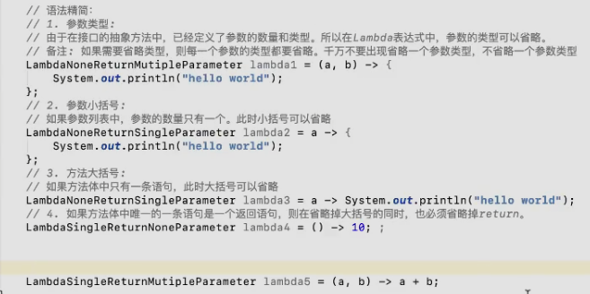

#### Stream

集合转stream

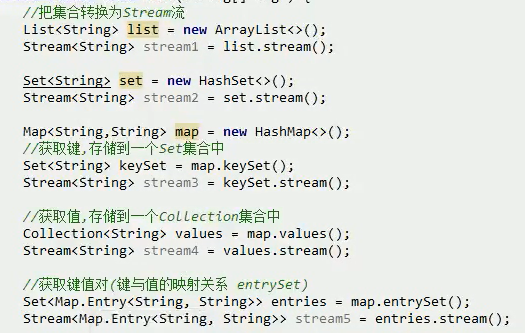

数组转stream

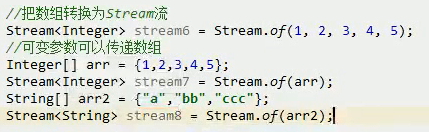

#### 终结方法

forEach、count


#### 基础写法

```java
// 1. 不需要参数,返回值为5   
() -> 5    
// 2. 接收一个参数(数字类型),返回其2倍的值
x -> 2 * x    
// 3. 接受2个参数(数字),并返回他们的差值，如果要省略参数类型，就要全部参数都省略，不能就省略一个
(x, y) -> x – y  
// 4. 接收2个int型整数,返回他们的和  
(int x, int y) -> x + y   
// 5. 接受一个 string 对象,并在控制台打印,不返回任何值(看起来像是返回void)  
s -> System.out.print(s) 
//也可以用方法引用来优化代码 
System.out::println
```

#### 优化Runnable的实现接口

   ```java
  public void test(){
        //old
        new Thread((new Runnable() {
            @Override
            public void run() {
                System.out.println("匿名内部类 实现线程");
            }
        })).start();
        //lambda实现
        new Thread( () -> System.out.println("java8 lambda实现线程")).start();
    }
   ```

### 实例(字符串)

基础代码

```java
 List<String> list = new ArrayList<>();
        list.add("a");
        list.add("cb");
        list.add("1111");
        list.add("c1112");
        list.add("c22223");
        list.add("d332334");
        list.add("c4544444");
```

输出以c开头的数据

> 用filter来过滤，因为他里面的是返回bool类型的，然后过滤完了之后再用forEach遍历刚刚过滤之后的数据，用方法引用(类名::方法名)这个表达式来输出字符串

```java
      list.stream().filter(s -> s.startsWith("c"))
                   .forEach(System.out::println);

//-------------------------
输出：
c1112
c22223
c4544444
```

#### 遍历集合

> 直接调用forEach然后在使用方法引用，直接可以遍历集合

```java
list.forEach(System.out::println);
```

#### 多过滤条件

输出长度大于4并且以c开头的字符串

```java
//第一种写法
list.stream().filter(s->s.length()>4).filter(s->s.startsWith("c"))
                .forEach(System.out::println);
//第二种写法，通过使用Predicate接口然后直接用and方法组合条件
 Predicate<String> lengthFilter=s->s.length()>4;
 Predicate<String> startCharFilter=s->s.startsWith("c");
 list.stream().filter(lengthFilter.and(startCharFilter))
                .forEach(System.out::println);
```

#### limit

> limit是用来设置遍历的条数，而不是返回的条数

遍历前4条数据

```java
 list.stream().limit(4).forEach(System.out::println);
```

遍历前5条，以c开头的数据

```java
list.stream().limit(5).filter(s->s.startsWith("c"))
                .forEach(System.out::println);
```

#### skip

> 跳过前面的n条数据

```java
Stream.of(1,2,3,4,5,6,7,8,9).skip(3).forEach(System.out::print);
//输出:456789
```

#### concat

> 合并两个流

```java
Stream<String> stream1 = Stream.of("111", "222", "333");
        Stream<String> stream2 = Stream.of("aaa", "bbb", "ccc");
        Stream<String> concat = Stream.concat(stream1, stream2);
        concat.forEach(System.out::print);
//输出:111222333aaabbbccc
```


### 实例(对象)

基础代码

```java
 List<Person> list = new ArrayList<>();
        Person person1=new Person();
        person1.setName("liu");
        person1.setAge(8);
        person1.setSex("男");
        Person person2=new Person();
        person2.setName("guan");
        person2.setAge(28);
        person2.setSex("女");
        Person person3=new Person();
        person3.setName("wu");
        person3.setAge(18);
        person3.setSex("女");

        list.add(person1);
        list.add(person2);
        list.add(person3);


class Person {
    private String name;
    private int age;
    private String sex;

    public int getAge() {
        return age;
    }

    public Person setAge(int age) {
        this.age = age;
        return this;
    }

    public String getSex() {
        return sex;
    }

    public Person setSex(String sex) {
        this.sex = sex;
        return this;
    }

    public String getName() {
        return name;
    }

    public Person setName(String name) {
        this.name = name;
        return this;
    }

    @Override
    public String toString() {
        return "Person{" +
                "name='" + name + '\'' +
                ", age=" + age +
                ", sex='" + sex + '\'' +
                '}';
    }
}
```

#### count

```java
//获取流的长度，就是集合的大小
long count = list.stream().count();
```

#### sorted的使用

按照年龄排序

```java
 list.stream().sorted((p1,p2) -> (p1.getAge() - p2.getAge()))
                .forEach(System.out::println);
```

按照姓名排序

```java
list.stream().sorted(Comparator.comparing(Person::getName))
                .forEach(System.out::println);
```

#### max

获取年龄最大的人

```java
//只会返回一个对象
Person oldest = list.stream().max(Comparator.comparing(Person::getAge)).get();
```

#### min

获取年龄最小的人

```java
//只会返回一个对象
Person oldest = list.stream().min(Comparator.comparing(Person::getAge)).get();
```

#### map

> 对集合中的每个元素进行遍历，并且可以对其进行操作，转化为其他对象

将集合中的每个人的年龄增加3岁

> setAge的返回值是一个对象，必须要是这样，不然的话会报错

```java
list.stream().map(e -> e.setAge(e.getAge() + 3)).forEach(System.out::println);
```

把字符串数组转为int数组

```java
 	    Stream<String> stringStream = Stream.of("1", "2", "3", "4");
        Stream<Integer> integerStream = stringStream.map(s -> Integer.parseInt(s));
        List<Integer> collect = integerStream.collect(Collectors.toList());
        collect.forEach(System.out::print);
```


#### reduce

> 也是对所有值进行操作，但它是将所有值，按照传入的处理逻辑，将结果处理合并为一个

将集合中的所有整数相加，并返回其总和
```java
 	    //第一个参数是上次函数执行的返回值（也称为中间结果），第二个参数是stream中的元素，
        // 这个函数把这两个值相加，得到的和会被赋值给下次执行这个函数的第一个参数。
        //要注意的是：第一次执行的时候第一个参数的值是Stream的第一个元素，第二个参数是Stream的第二个元素
        //将所有人的年龄加起来 求和
        List<Integer> ages = Arrays.asList(2,5,3,4,7);
        int totalAge = ages.stream().reduce((sum,age) -> sum + age).get();
        System.out.println(totalAge);
		//返回：21	

        //带初始值(这里为1)的计算,如果list没有元素,即stream为null,则直接返回初始值
        int totalAge1 = ages.stream().reduce(1,(sum,age) -> sum+age);
        List<Integer> initList = new ArrayList<>();
        int initTotalAge = initList.stream().reduce(1,(sum,age) -> sum+age);
        System.out.println("totalAge1: "+ totalAge1 + " initTotalAge: " + initTotalAge);
		//返回：totalAge1: 21 initTotalAge: 1
```

#### collect

> collect方法以集合中的元素为基础，生成新的对象

 在实际中，我们经常会以集合中的元素为基础，取其中的数据，来生成新的结果集，例如 按照过滤条件，返回新的List，

或者将集合转化为 Set 或Map等操作，通过collect方法实现是十分简便的：

```java
 List<Person> filterList = list.stream().filter(e -> e.getAge() >20).collect(Collectors.toList());
        filterList.forEach(e -> System.out.println(e.toString()));

        //将 name 属性用" , "，连接拼接成一个字符串
        String nameStr = list.stream().map(Person::getName).collect(Collectors.joining(","));
        System.out.println(nameStr);
        //将name 放入到新的 set 集合中
        Set<String> nameSet = list.stream().map(person -> person.getName()).collect(Collectors.toSet());
        nameSet.forEach(e -> System.out.print(e + ","));

        System.out.println();
        System.out.println("map--------");
        Map<String,Person> personMap = list.stream().collect(Collectors.toMap(Person::getName, person -> person));
        personMap.forEach((key,val) -> System.out.println(key + ":" + val.toString()));
//----------
返回：
Person{name='guan', age=28, sex='女'}
liu,guan,wu
liu,guan,wu,
map--------
liu:Person{name='liu', age=8, sex='男'}
guan:Person{name='guan', age=28, sex='女'}
wu:Person{name='wu', age=18, sex='女'}
```

```java
//		1构造数组
		List<Employee> list = Arrays.asList(new Employee(1L, "e1"),new Employee(2L, "e2"),new Employee(3L, "e3"));
		
//		2 所有name收集成list。toList
		List<String> nameList = list.stream().map(x->x.getName()).collect(Collectors.toList());
//		3 name收集成set 。toSet
		Set<String> nameSet = list.stream().map(x->x.getName()).collect(Collectors.toSet());
//		4 list转为map
		Map<Long, String> map = list.stream().collect(Collectors.toMap(Employee::getId, Employee::getName));
//		key重复时报错的解决
		Map<Long, String> map2 = list.stream().collect(Collectors.toMap(Employee::getId, Employee::getName,(k2,k1)->k1));
//		5 根据id分组
		Map<Long, List<Employee>> groupByMap = list.stream().collect(Collectors.groupingBy(Employee::getId));
//		6 分区 分区是分组的特殊情况。  它最多可以分为两组,如id大于2和不大于2的
		Map<Boolean, List<Employee>> part = list.stream().collect(Collectors.partitioningBy(x->x.getId()>2));
//		7 name用逗号相连
		String join = list.stream().map(Employee::getName).collect(Collectors.joining(","));
// 转载请标明链接：https://blog.csdn.net/wabiaozia/article/details/103323564

```

#### summaryStatistics

>  计算集合元素的最大、最小、平均等值

IntStream、LongStream 和 DoubleStream 等流的类中，有个非常有用的方法叫做 summaryStatistics()，可以返回 IntSummaryStatistics、LongSummaryStatistics 或者 DoubleSummaryStatistics，描述流中元素的各种摘要数据

```java
List<Integer> ages = Arrays.asList(2,5,3,4,7);
        IntSummaryStatistics statistics = ages.stream().mapToInt(e -> e).summaryStatistics();
        System.out.println("最大值: " + statistics.getMax());
        System.out.println("最小值: " + statistics.getMin());
        System.out.println("平均值: " + statistics.getAverage());
        System.out.println("总和: " + statistics.getSum());
        System.out.println("个数: " + statistics.getCount());
//-------
返回：
最大值: 7
最小值: 2
平均值: 4.2
总和: 21
个数: 5
```


## 方法引用

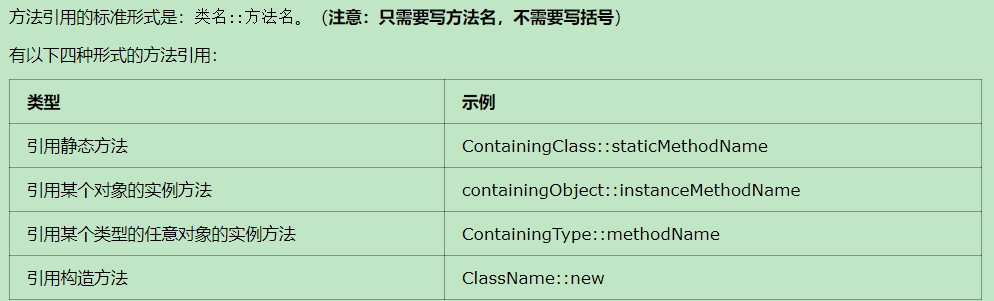

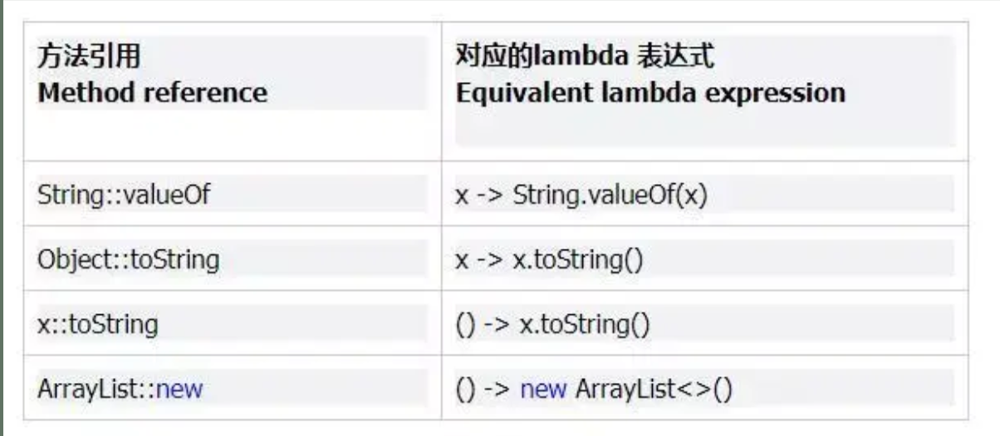

#### 静态方法

简化输出方法

```java
//简化前 
System.out.println()
//简化后
System.out::println
//简化绝对值的写法	
Math::abs
```

调用父类的成员方法

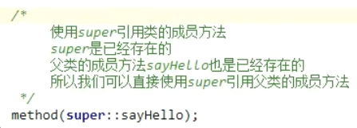

#### 非静态方法

调用对象的成员方法

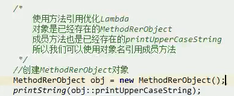

通过this调用本类的成员方法

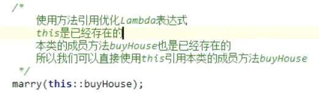

#### 构造方法

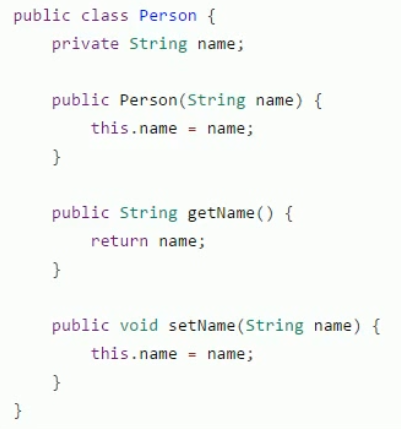

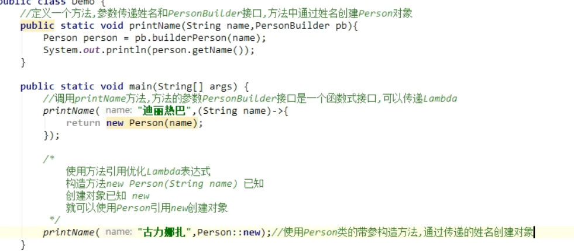

数组构造器

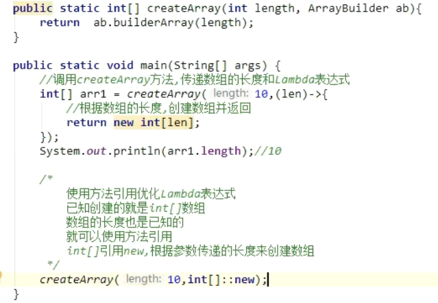