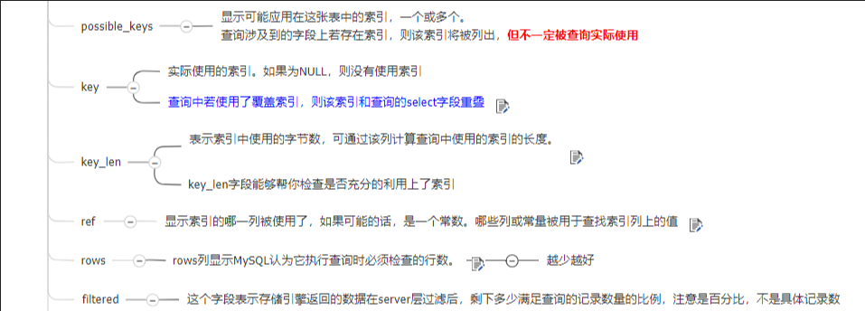

MYSQL基础

[MYSQL复习宝典.html](MYSQL复习宝典.html) 

## 数据类型


## 数据表操作语法

#### 系统变量

```mysql
#带@@的就是系统变量
SELECT @@lower_case_table_names
#修改系统变量，不加global代表只有当前窗口回话有用，加了代表所有回话都有用
set global log_bin_trust_function_creators=1;

```

#### 不使用缓存

```mysql
#通过使用SQL_NO_CACHE关键字就可以让查询的时候不适用sql缓存
SELECT SQL_NO_CACHE * FROM emp
```

#### 查看当前所有的数据库

```mysql
show databases;
```

#### 打开指定的库

```mysql
use 表名
```

#### 查看当前库的所有表

```mysql
show tables;
```

#### 查看其它库的所有表

```mysql
show tables from 库名;
```

#### 查看表结构

```mysql
desc 表名;
```

#### 注释

```mysql
单行注释：#注释文字
单行注释：-- 注释文字
多行注释：/* 注释文字  */
```

#### 查看表的所有索引

```mysql
SHOW INDEX FROM 表名
```

#### 去除重复的值

```mysql
SELECT DISTINCT 字段 FROM 表名
#使用DISTINCT关键字可以去除重复的值
```

#### 加号'+'的使用

```mysql
SELECT 80+20 		结果100       # 都是数值型直接相加
SELECT 80+'20' 		结果100  		# 如果可以把字符型数据转化为数值型，他就会进行加法运算
SELECT 80+'a20' 	结果80  		# 字符型数据转化为数值型失败，就会把字符数据变成0
SELECT 'aa'+'a20' 	结果0 		# 字符型数据转化为数值型失败，就会把字符数据变成0
SELECT 22+null 		结果null 		# 只要有一方为null，结果都是为null
```

#### like

```mysql
SELECT * FROM employees WHERE first_name LIKE 'a_e%'
# a_e% ：第一位和第三位是要为a和e,'_'是占位符，任意字符
# a%   : 以a开头
# %a   : 以a结尾
# %a%  : 只要有a就可以
# _\_% ：查询'K_ing'这种数据，\是转义符
# LIKE '_&_%' ESCAPE '&' ：默认的转义符是\,如果要用其他的的代替就需要在后面加一个ESCAPE '自定义的转义符'
```

#### BETWEEN TO

```mysql
SELECT * FROM employees WHERE id BETWEEN 100 AND 200
#查询id在100-200之间的数据，包含100和200，相当于是 id>=100 AND id<=200
```

#### IS NULL

```mysql
SELECT * FROM employees WHERE salary IS  NULL
#salary为空的数据
```

#### IS NOT NULL

```mysql
SELECT * FROM employees WHERE salary IS NOT NULL
#salary不为空的数据
```

#### IN

```mysql
#查询工资为7700和8200的数据
select * from employees where salary in (7700,8200)
#NOT IN就是和IN的功能相反
```

#### ANY

```mysql
#查询工资比工种为IT_PROG的任意一个人的工资高的数据
#any(这里的必须是一个查询)，作用就是只需要满足其中的任何一个数据就可以了
select * from employees where salary > 
ANY(SELECT  salary FROM employees WHERE job_id ='IT_PROG')
```

#### ALL

```mysql
#查询工资比工种为IT_PROG的所有员工的工资都要高的数据(就是查询工资比他们最大值还高的数据)
select * from employees where salary > 
all(SELECT  salary FROM employees WHERE job_id ='IT_PROG')
```


#### 安全等于<=>

```mysql
SELECT * FROM employees WHERE salary <=> 100
#查询salary为100的数据
SELECT * FROM employees WHERE salary <=> null
#查询salary为null的数据
#安全等于可以是等于null，也可以是等于普通类型的数据，可读性不高
```

#### 安全不等于<>

```mysql
SELECT * FROM employees WHERE name <> 'IT_PROG'
#查询name不等于IT_PROG的数据，可读性差，但是可移植性高，因为其他数据库可能不正常!=,但是他们都支持<>
```

#### 去除重复(DISTINCT)

```mysql
SELECT DISTINCT salary FROM employees
#加了DISTINCT关键字之后，显示的值都是不重复的
```

#### 排序(ORDER BY)

```mysql
SELECT DISTINCT manager_id FROM employees ORDER BY manager_id DESC
#desc是从高到低，不写是从低到高(默认asc)
SELECT  * FROM employees ORDER BY manager_id DESC,employee_id asc
#先按manager_id从高到低排序，在按照employee_id从低到高
```

#### 内连接

```mysql
#查询 员工名和上级的名称
#方法一
SELECT e.employee_id,e.last_name,m.employee_id,m.last_name
FROM employees e,employees m
WHERE e.manager_id=m.employee_id;
#方法二
SELECT
  e.last_name,
  e.first_name, 
  ( SELECT CONCAT(last_name,first_name) manager_name 
  FROM employees m WHERE m.employee_id=e.manager_id) managerName
FROM employees e

```

#### join连接


##### 创建表

```mysql
CREATE TABLE `t_dept` (
 `id` INT(11) NOT NULL AUTO_INCREMENT,
 `deptName` VARCHAR(30) DEFAULT NULL,
 `address` VARCHAR(40) DEFAULT NULL,
 PRIMARY KEY (`id`)
) ENGINE=INNODB AUTO_INCREMENT=1 DEFAULT CHARSET=utf8;
CREATE TABLE `t_emp` (
 `id` INT(11) NOT NULL AUTO_INCREMENT,
 `name` VARCHAR(20) DEFAULT NULL,
  `age` INT(3) DEFAULT NULL,
 `deptId` INT(11) DEFAULT NULL,
empno int  not null,
 PRIMARY KEY (`id`),
 KEY `idx_dept_id` (`deptId`)
 #CONSTRAINT `fk_dept_id` FOREIGN KEY (`deptId`) REFERENCES `t_dept` (`id`)
) ENGINE=INNODB AUTO_INCREMENT=1 DEFAULT CHARSET=utf8;
INSERT INTO t_dept(deptName,address) VALUES('华山','华山');
INSERT INTO t_dept(deptName,address) VALUES('丐帮','洛阳');
INSERT INTO t_dept(deptName,address) VALUES('峨眉','峨眉山');
INSERT INTO t_dept(deptName,address) VALUES('武当','武当山');
INSERT INTO t_dept(deptName,address) VALUES('明教','光明顶');
INSERT INTO t_dept(deptName,address) VALUES('少林','少林寺');
INSERT INTO t_emp(NAME,age,deptId,empno) VALUES('风清扬',90,1,100001);
INSERT INTO t_emp(NAME,age,deptId,empno) VALUES('岳不群',50,1,100002);
INSERT INTO t_emp(NAME,age,deptId,empno) VALUES('令狐冲',24,1,100003);
INSERT INTO t_emp(NAME,age,deptId,empno) VALUES('洪七公',70,2,100004);
INSERT INTO t_emp(NAME,age,deptId,empno) VALUES('乔峰',35,2,100005);
INSERT INTO t_emp(NAME,age,deptId,empno) VALUES('灭绝师太',70,3,100006);
INSERT INTO t_emp(NAME,age,deptId,empno) VALUES('周芷若',20,3,100007);
INSERT INTO t_emp(NAME,age,deptId,empno) VALUES('张三丰',100,4,100008);
INSERT INTO t_emp(NAME,age,deptId,empno) VALUES('张无忌',25,5,100009);
INSERT INTO t_emp(NAME,age,deptId,empno) VALUES('韦小宝',18,null,100010);
```

##### 查询语句

```MYSQL
#如果确定两张关联的表没有重复的数据的时候就要用union all，因为这样的效率更高
#inner join(inner可以省略)
SELECT * FROM t_emp a INNER JOIN t_dept b ON a.deptId=b.id
#LEFT join
SELECT * FROM t_emp a LEFT JOIN t_dept b ON a.deptId=b.id
#LEFT join(a表独有的数据)
SELECT * FROM t_emp a LEFT JOIN t_dept b ON a.deptId=b.id WHERE b.id IS null
#LEFT join(b表独有的数据)
SELECT * FROM t_dept b LEFT JOIN  t_emp a  ON a.deptId=b.id WHERE a.id IS null
#相当于是全集搜索(a和b的全部数据)
SELECT a.*,b.* FROM t_emp a LEFT JOIN t_dept b ON a.deptId=b.id
UNION ALL
SELECT  a.*,b.* FROM t_dept b LEFT JOIN  t_emp a  ON a.deptId=b.id
WHERE a.id IS NULL
#a和b的独有数据
SELECT a.*,b.* FROM t_emp a LEFT JOIN t_dept b ON a.deptId=b.id WHERE b.id IS NULL
UNION ALL
SELECT a.*,b.* FROM t_dept b LEFT JOIN  t_emp a  ON a.deptId=b.id WHERE a.id IS NULL
```

#### 标量子查询(在where后面使用，一行一列)

```mysql
#1.查询工资比Abel高的人员
SELECT * FROM employees WHERE 
salary > (SELECT salary FROM employees WHERE last_name='Abel')
#2.返回job_id与141号员工相同，salary比143号员工多的员工
SELECT * FROM employees WHERE job_id=(SELECT job_id FROM employees WHERE employee_id=141)
AND salary > (SELECT salary FROM employees WHERE employee_id=143)
#3.返回公司工资最少的员工
SELECT * FROM employees 
WHERE salary=(SELECT MIN(salary) FROM employees)
#4.查询最低工资大于50号部门的最低工资
SELECT * FROM employees GROUP BY department_id
HAVING MIN(salary) > (SELECT MIN(salary) FROM employees WHERE department_id = 50)
####标量子查询的结果必须是一行一列，不然会报错
####子查询的优先级都会大于主查询，因为必须要先把子查询的结果查出来才能查出条件的值
        
```

#### 列子查询(一列多行)

```mysql
#1.返回location_id是1400或1700的部门的所有数据，也可以把IN(字表)改为=ANY(字表)
SELECT * FROM employees WHERE department_id IN 
(SELECT DISTINCT department_id FROM departments WHERE location_id IN (1400, 1700))
#2.返回其它工种中比job_id为‘IT_PROG’的工种的任意一个工资低的员工的数据
SELECT * FROM employees WHERE salary <  
any(SELECT DISTINCT salary FROM employees WHERE job_id ='IT_PROG' )
and job_id != 'IT_PROG'
#3.返回其它工种中比job_id为‘IT_PROG’的工种的所有工资低的员工的数据(就是工资要比他们都低)
SELECT * FROM employees WHERE salary <  
all(SELECT DISTINCT salary FROM employees WHERE job_id ='IT_PROG' )
and job_id != 'IT_PROG'
```

#### 行子查询(一行多列)

```mysql
#1.查询员工编号最小并且工资最高的员工信息
#可以直接where(多个字段)，只要字段和字表查询中的字段一一匹配就可以了
select * from employees where (employee_id,salary)=
(SELECT min(employee_id),max(salary) FROM employees)
```

#### select后面的子查询(只能一行一列)

```mysql
#查询每个部门的员工个数
select *,(select count(*) from employees e where e.department_id=d.department_id) 个数 from departments d

```

#### from后面(将子查询的结果当成一张表，必须要别名)

```mysql
#查询每个部门的平均工资的工资等级
#lowest_sal最低工资，highest_sal最高工资，grade_level等级类型
select dep.*,job.grade_level from 
(select avg(salary) sa ,department_id from employees group by department_id) dep
 join job_grades job on dep.sa BETWEEN job.lowest_sal and job.highest_sal
```

#### exists(用来判断是否存在)

```mysql
select exists(select * from employees where employee_id=2000)
#只要查询到一个值就直接返回1，返回1
select exists(select * from employees)
#查询不到值就返回0
#查询有员工的部门名
select * from departments d where exists (select * from employees e where e.department_id=d.department_id)
#如果where在后面是1然后当在查询的时候就会把这一行给返回回去，如果是0，就不返回这一行
select * from departments where 1或0

```

#### UNION

```mysql
#联合查询，把两个条件分成两个查询语句，这样如果当查询条件很复杂的时候就可以用union关键字来拆分查询
#联合查询的返回列数必须要一样！！！
#使用union是默认去除重复的，但是如果使用union all 就可以不设置去重，就会把重复的也显示出来
SELECT * FROM employees WHERE last_name LIKE '%a%' 
UNION
SELECT * FROM employees WHERE salary > 8000
```

#### INSERT

```mysql
#传统写法
INSERT INTO job_grades(grade_level,lowest_sal,highest_sal)
VALUES('DD',2000,3000)
#插入多行
INSERT INTO job_grades(grade_level,lowest_sal,highest_sal)
VALUES('DDD',2000,3000),('EEE',1000,1000)
#子查询
INSERT INTO job_grades(grade_level,lowest_sal,highest_sal)
SELECT 'DDD',200,300
#通过set来插入,只需要设置需要的值，但是不能为空的值就必须要设置，实现的功能和常用的写法一样
INSERT INTO job_grades
SET grade_level='DD',lowest_sal=2000
###传统写法支持子查询，支持插入多行，set方法都不支持，推荐使用传统写法
```

#### UPDATE

```mysql
#单表修改
UPDATE employees SET salary=99999999 WHERE employee_id=100
#多表修改
#也要先关联表
UPDATE employees e JOIN  departments d
ON e.department_id=d.department_id
SET e.phone_number=999999999
WHERE d.manager_id=200

```

多表修改


#### DELETE

```mysql
#单表删除，清空整张employees表，自增长也是从断点开始
DELETE FROM employees
#单表删除，根据条件删除
DELETE FROM employees WHERE first_name='Lex'
#delete是如果是有自增长的话，比如现在是有3条数据，然后id是1~3，然后把3给删除掉，然后在插入一条，这条数据的id就是为4
#truncate不能回滚，delete可以回滚
```

多表删除


#### TRUNCATE

```mysql
#清空整个数据表，效率比delete高，不能加条件，单纯是删除该表的所有数据
#使用这个命令是只会返回一句共0行受到影响，delete是会返回实际的影响行数(就是delete有返回值)
#truncate不能回滚，delete可以回滚
#如果清空了所有数据，然后在重新插入的时候id就是从1开始了，delete是从断点开始
TRUNCATE TABLE employees
```

## 操作数据表

#### 创建数据表

```mysql
create table 表名(
	列名 列类型 是否为空(可以不写) DEFAULT 默认值(可以不写),
	列名 列类型 是否为空(可以不写) DEFAULT 默认值(可以不写),
	......
)ENGINE=InnoDB AUTO_INCREMENT=22 DEFAULT CHARSET=utf8;
1.ENGINE=INNODB：将数据库的引擎设置为InnoDB（mysql中两种数据库引擎 ：MyISAM 、InnoDB）
2.AUTO_INCREMENT=22：自动增长的起始值为22
3.DEFAULT CHARSET=utf8：设置数据库的默认字符集为utf8
```

#### 复制数据表

```mysql
#单纯复制数据表结构，不复制值
CREATE TABLE new_table LIKE old_table	
#复制表的结构，但是不是复制所有的列
#这里是代表把ID和age字段复制过去，where 0的意思是值是为空的，所以就单纯的复制字段
CREATE TABLE peoples_copy2 SELECT ID,age FROM peoples WHERE 0
#复制表结构并且把值也复制过去
CREATE TABLE peoples_copy2 SELECT * FROM peoples
#复制表结构并且把值也复制过去，但是复制过去的值是经过筛选的
CREATE TABLE peoples_copy2 SELECT * FROM peoples  WHERE age>18
#复制指定的字段并且值也复制过去
CREATE TABLE peoples_copy3 SELECT ID,age FROM peoples WHERE age<3
```

#### 修改数据表名

```mysql
#修改数据表名
ALTER TABLE people RENAME TO people_new
```

#### 修改列名

```mysql
#修改people表里面的列名为age的改为Age，类型要加上，COLUMN关键字也可以省略
ALTER TABLE people CHANGE COLUMN(可以省略) age Age VARCHAR(200)
```

#### 修改列类型

```mysql
#修改字段的类型，这里是修改age的类型为bigint
ALTER TABLE people MODIFY COLUMN(可以省略) age BIGINT(20)
```

#### 添加列

```mysql
#添加一列，其他同上
ALTER TABLE people ADD COLUMN testcolumn VARCHAR(20)
```

#### 删除列

```mysql
#删除一列，其他同上
ALTER TABLE people DROP COLUMN testcolumn
```

#### 删除数据表

```mysql
#删除这个数据表可以加上(IF NOT EXISTS)来防止要删除的表不存在
DROP TABLE peoples
```

## 约束

#### 常见约束

```mysql
NOT NULL：非空，该字段的值必填
UNIQUE：唯一，该字段的值不可重复
DEFAULT：默认，该字段的值不用手动插入有默认值
CHECK：检查，mysql不支持
PRIMARY KEY：主键，该字段的值不可重复并且非空  unique+not null
FOREIGN KEY：外键，该字段的值引用了另外的表的字段
auto_increment：自增长列
```


#### 自增长列特点

```txt
1、不用手动插入值，可以自动提供序列值，默认从1开始，步长为1
如果要更改起始值：手动插入值,比如手动插入一个10，然后后面都会从10开始
如果要更改步长：更改系统变量
set auto_increment_increment=值;
2、一个表至多有一个自增长列
3、自增长列只能支持数值型
4、自增长列必须为一个key，可以是唯一值也可以是主键
```


#### 列级约束


#### 外键使用下面的写法(表级约束)


#### 组合主键和组合外键(这里是表级约束)


#### 主键，外键和唯一的区别


#### 修改约束(列级约束)

```mysql
#添加非空约束
ALTER TABLE 表名 MODIFY COLUMN 字段名 字段类型 NOT NULL
#添加默认值约束
ALTER TABLE 表名 MODIFY COLUMN 字段名 字段类型 DEFAULT '默认值'
#添加主键约束
ALTER TABLE 表名 MODIFY COLUMN 字段名 字段类型 PRIMARY KEY
#添加自增长约束
ALTER TABLE 表名 MODIFY COLUMN 字段名 字段类型 (这里是主键或者是UNIQUE) AUTO_INCREMENT
```

#### 修改约束(表级约束)

```mysql
#添加主键约束
ALTER TABLE 表名 ADD PRIMARY KEY(字段名)
#添加唯一约束
ALTER TABLE 表名 ADD UNIQUE(字段名)
#添加外键约束
ALTER TABLE 表名 ADD CONSTRAINT fk_stuinfo_major FOREIGN KEY(本表字段名) REFERENCES major(外键表字段名);
```

#### 删除约束

```mysql
#删除非空
alter table 表名 modify column 字段名 字段类型 ;
#删除默认
alter table 表名 modify column 字段名 字段类型 ;
#删除主键
alter table 表名 drop primary key;
#删除唯一
alter table 表名 drop index 索引名;
#删除外键
alter table 表名 drop foreign key 约束名;
#删除自增长(因为自增长列肯定有一个key的约束，所以直接什么都不设置就可以把自增长给去除了)
alter table 表名 MODIFY COLUMN 字段名 字段类型 
```


## 操作数据库

#### 创建数据库

```mysql
#创建数据库，并且添加了验证，(IF NOT EXISTS)这句可以不加，如果加了，当要创建的数据库已经存在的时候就不会报异常
#创建数据库和数据表之前一般都是先执行删除语句要加上判断是否存在的那句话
CREATE DATABASE IF NOT EXISTS testbase
```


## 规范

1. 虽然mysql不区分大小写，但是最好关键字都要大写，然后表名和列名小写

## 常用函数

### 字符串函数

#### CONCAT

```mysql
SELECT CONCAT('aa','bb','cc') #结果：aabbcc
SELECT CONCAT('aa')			 #结果：aa
SELECT CONCAT('aa',11,'cc')   #结果：异常，只能是拼接字符串
```

#### IFNULL

```mysql
SELECT 12*IFNULL(commission_pct,100) FROM employees
#如果commission_pct是为null，就返回100，如果不为null就返回commission_pct
```

#### LENGTH

```mysql
SELECT LENGTH('aaa4aaaa')
#是获取直接的长度不是字符串的长度，返回8
SELECT LENGTH('abc啊啊')
#因为字母占一个字节，汉子占3个字节，返回9
```

#### UPPER

```mysql
SELECT UPPER('aBCDe')
#字符串转大写：ABCDE
```

#### LOWER

```mysql
SELECT LOWER('aaBCdea')
#字符串转小写：abcde
```

#### SUBSTR

```mysql
SELECT SUBSTR('abcdedg',3)
#mysql索引是从1开始的，不是从0开始的，这里代表从索引为3的开始截取后面的字符串，返回:cdedg
SELECT SUBSTR('abcdedg',1,3)
#从索引为1的开始截取三个字符，返回：abc
```

#### INSTR

```mysql
SELECT INSTR('abcdedg','aa')
#为找到aa在abcdedg出现的地方，返回：0
SELECT INSTR('abcdedg','cd')
#在索引为3的地方找到了参数2，返回：3
SELECT INSTR('aafscddbcdedg','cd')
#在索引为5的地方找到了参数2，只找第一次出现的地方，返回：5
```

#### TRIM

```mysql
SELECT TRIM('  abcd edg  ')
#去除字符串前后的空格，返回abcd edg
SELECT TRIM('aa' FROM 'aaaabbbaaaabbbbaaaaa')
#去除前后为aa的字符串,返回：bbbaaaabbbba(因为最后是有5个a,但是是去除aa所以就会剩余一个a)
```

#### LPAD

```mysql
SELECT LPAD('aaaaa',10,'bc')
#在参数1的左边添加参数3，已达到字符串的长度为10(字符长度，不是字节长度)，返回：bcbcbaaaaa
SELECT LPAD('aaaaa',10,'啊')
#因为是字符长度为10，而不是字节长度，返回：啊啊啊啊啊aaaaa
```

#### RPAD

```mysql
SELECT RPAD('aaaaa',10,'啊')
#和LPAD一样的功能和用法，只不过是在右边填充，返回：aaaaa啊啊啊啊啊
```

#### REPLACE

```mysql
SELECT REPLACE('方法为了父女俩刷卡即可了解','刷卡','啊啊啊啊')
#替换字符串，如果参数1中不存在参数2的字符串，则不进行任何操作，返回：方法为了父女俩啊啊啊啊即可了解
```

#### LEFT

```mysql
SELECT LEFT('abcdefg',3)
#从左边截取三个字符，返回abc
```

#### RIGHT

```mysql
SELECT RIGHT('abcdefg',3)
#从右边截取三个字符，返回efg
```

### 数学函数

#### ROUND

```mysql
SELECT ROUND(2.6234)
#四舍五入不保留小数，返回：3
SELECT ROUND(2.6274,2)
#四舍五入，保留两位小数，返回：2.63
SELECT ROUND(-2.3234)
#返回：-2
SELECT ROUND(-2.6234)
#返回：-3
```

#### CEIL

```mysql
SELECT CEIL(2.00)
#向上取整，返回>=该参数的最小整数，返回：2
SELECT CEIL(2.32)
#返回：3
SELECT CEIL(-2.32)
#返回：-2
```

#### FLOOR

```mysql
SELECT FLOOR(2.46)
#向下取整，返回<=该参数的最大整数，返回：2
SELECT FLOOR(-2.46)
#返回：-3
```

#### TRUNCATE

```mysql
SELECT TRUNCATE(2.246,2)
#保留两位小数(不去判断任何东西，单纯保留)，返回：2.24
SELECT TRUNCATE(2.243,0)
#返回：2
```

#### MOD

```mysql
SELECT MOD(11,3)
#取余，相当于java中的11%3,mod(a,b)=>a-a/b*b，返回：2
SELECT MOD(-11,-3)
#返回：-2
```

### 日期函数(太多了，合并到一起)

```mysql
################获取一个日期时间的部分数据
SELECT NOW()
-- 2020-01-12 16:46:05
SELECT CURDATE()
-- 2020-01-12
SELECT CURTIME()
-- 16:46:42
################获取一个日期时间的部分数据
SELECT DATE('2018-11-01 13:12:41');   
-- [2018-11-01]  #获取日期部分
SELECT TIME('2018-11-01 13:12:41');   
-- [13:12:41]    #获取时间部分
SELECT YEAR('2018-11-01 13:12:41');   
-- [2018]        #获取年
SELECT MONTH('2018-11-01 13:12:41'); 
-- [11]          #获取月
SELECT DAY('2018-11-01 13:12:41');   
-- [1]           #获取天
SELECT HOUR('2018-11-01 13:12:41');  
-- [13]          #获取时
SELECT MINUTE('2018-11-01 13:12:41'); 
-- [12]          #获取分
SELECT SECOND('2018-11-01 13:12:41'); 
-- [41]          #获取秒
SELECT QUARTER('2018-08-02'); 
-- [3]     #获取季节（1,2,3,4）->（1~3,4~6,7~9,10~12）
SELECT WEEK('2018-02-01',0);   
-- [4]   一年中的第几个星期，要根据具体需求设置后面的 model 参数，model 不同得到的结果会有差异
SHOW VARIABLES LIKE 'default_week_format'
-- 查看系统默认的mode
SELECT WEEK('2020-01-5 15:58:48',0);
#因为2020-1-5是星期天，并且mode为0代表星期日是一周的开始，所以返回1
SELECT WEEK('2020-01-4 15:58:48',0);
#因为2020-1-4是星期六，mode为0代表星期日是一周的开始，所以返回0
SELECT WEEK('2020-01-5 15:58:48',1);
#因为2020-1-5是星期天，并且mode为1代表星期一是一周的开始，所以返回1
SELECT WEEK('2020-01-6 15:58:48',1);
#因为2020-1-6是星期一，并且mode为1代表星期一是一周的开始，所以返回2
SELECT CURDATE()/CURRENT_DATE()/CURRENT_DATE;
    -- [2018-08-01]          #获取当前日期。这三种写法是同义的,都是一样的功能，下同
SELECT CURTIME()/CURRENT_TIME()/CURRENT_TIME;
    -- [12:41:55]          #获取当前时间
SELECT NOW()/CURRENT_TIMESTAMP()/CURRENT_TIMESTAMP;
    -- [2018-08-01 12:42:19]    #获取当前日期 + 时间
################增减 年、月、日、时、分、秒
SELECT DATE_ADD('2018-08-01', INTERVAL 1 YEAR);      -- [2019-08-01]      #年份+1
SELECT DATE_ADD('2018-12-01', INTERVAL 1 MONTH);     -- [2019-01-01]      #月份+1
SELECT DATE_ADD('2018-08-01', INTERVAL 1 DAY);       -- [2018-08-02]      #天数+1
SELECT DATE_ADD('2018-08-01', INTERVAL -1 DAY);      -- [2018-07-31]      #天数-1
SELECT DATE_ADD('2018-08-01 13:12:41', INTERVAL 1 HOUR);   -- [2018-08-01 14:12:41] #小时+1
SELECT DATE_ADD('2018-08-01 13:12:41', INTERVAL 1 MINUTE); -- [2018-08-01 13:13:41] #分钟+1
SELECT DATE_ADD('2018-08-01 13:12:41', INTERVAL 1 SECOND); -- [2018-08-01 13:12:42] #秒数+1
SELECT DATE_ADD('2018-08-01', INTERVAL 1 WEEK);          -- [2018-08-08] #增加一个星期（7天）
SELECT DATE_ADD('2018-08-01',INTERVAL 1 YEAR_MONTH);     -- [2018-09-01] #增加一年零一个月
    -- DAY_HOUR       : 日和小时
    -- DAY_MINUTE     : 日和分钟
    -- DAY_SECOND     : 日和秒
    -- HOUR_MINUTE    : 小时和分
    -- HOUR_SECOND    : 小时和秒
    -- MINUTE_SECOND  : 分和秒
SELECT DATE_SUB('2018-08-01', INTERVAL 1 YEAR);
    -- [2017-08-01]   #date_sub()与date_add()相反
################计算日期间隔
SELECT DATEDIFF('2018-08-14', '2018-08-01');   -- [13]   #计算两个日期间隔的天数
SELECT DATEDIFF('2018-08-01', '2018-08-14');   -- [-13]  #计算两个日期间隔的天数
 
SELECT TIMEDIFF('2018-08-01 01:30:00', '2018-08-01 01:00:00');
    -- [00:30:00]     #计算两个时间间隔，两个参数格式必须要一样
SELECT TIMEDIFF('2018-08-01 01:00:00', '2018-08-01 01:30:00');
    -- [-00:30:00]     #计算两个时间间隔，两个参数格式必须要一样
###############字符串转换为日期
SELECT STR_TO_DATE('11/09/2014', '%m/%d/%Y');
    -- [2014-11-09]    #字符串的日期间隔符要和后面的一样
SELECT STR_TO_DATE('11-09-2014', '%m-%d-%Y');
    -- [2014-11-09]
SELECT STR_TO_DATE('2014$11$09', '%Y$%m$%d');
    -- [2014-11-09]    #用其他间隔符也可以，但前后要统一！！！
SELECT STR_TO_DATE('13:12:41', '%H:%i:%s');
    -- [13:12:41]
SELECT STR_TO_DATE('2014-09-11 13:12:41', '%Y-%m-%d %H:%i:%s');
    -- [2014-09-11 13:12:41] #分钟用i，不要用m
###############日期转换为字符串
SELECT DATE_FORMAT(NOW(),'%Y年%m月%d日 %H时%i分%s秒');  -- [2018年08月01日 15时26分39秒]
SELECT TIME_FORMAT(CURTIME(),'%H时%i分%s秒');          -- [15时28分03秒]    #只能转换时间部分
###############时间和秒数的互转	
SELECT TIME_TO_SEC('00:30:00');  -- [1800]       #时间转为秒
SELECT SEC_TO_TIME(1801);        -- [00:30:01]   #秒转时间
###############指定日期到 0000-01-01 过去了多少天
SELECT TO_DAYS('0000-01-01');    -- [1]
SELECT TO_DAYS('2018-01-02');    -- [737061]
SELECT FROM_DAYS(0);             -- [0000-00-00]
SELECT FROM_DAYS(737062);        -- [2018-01-03]
###############时间戳与日期互转
-- 时间戳是指格林威治时间1970年01月01日00时00分00秒
-- (北京时间1970年01月01日08时00分00秒)起至现在的总秒数
SELECT UNIX_TIMESTAMP();                        -- [1533109596]
SELECT UNIX_TIMESTAMP('1970-01-01 08:00:01');   -- [1]
SELECT FROM_UNIXTIME(1);                        -- [1970-01-01 08:00:01]
SELECT FROM_UNIXTIME(1,'%Y年%m月%d日 %H时%i分%s秒');    -- [1970年01月01日 08时00分01秒]
###############拼凑日期，时间
SELECT MAKEDATE(2018,02);    -- [2018-01-02]
SELECT MAKEDATE(2018,32);    -- [2018-02-01]
SELECT MAKETIME(17,30,01);   -- [17:30:01]
###############个性化显示时间日期
SELECT DAYOFWEEK('2018-08-01');   -- [4]   #得到指定日期是一个星期的第几天，注意：星期天是第1天
SELECT DAYOFMONTH('2018-08-05');  -- [5]   #得到指定日期是一个月的第几天
SELECT DAYOFYEAR('2018-08-01');   -- [213] #得到指定日期是一年的第几天

```


### 系统函数

#### DATABASE

```mysql
SELECT DATABASE();
#当前的数据库名，返回：myemployees
```

#### VERSION

```mysql
SELECT VERSION()
#当前mysql的版本号,返回：5.5.36
```

#### USER

```mysql
SELECT USER()
#当前的用户，返回：root@localhost
```

#### PASSWORD

```mysql
SELECT PASSWORD("abc")
#mysql自带的加密函数，返回：*0D3CED9BEC10A777AEC23CCC353A8C08A633045E
```

#### MD5

```mysql
SELECT MD5("abc")
#md5加密，返回：900150983cd24fb0d6963f7d28e17f72
```


### 流程控制函数

#### IF

```mysql
SELECT IF(5<4,'返回真','返回假')
# 返回：返回假
```

#### 多重IF

```mysql
SELECT first_name,salary,CASE 
WHEN salary>20000 THEN 'A'
WHEN salary>15000 THEN 'B'
WHEN salary>10000 THEN 'C'
ELSE 'D'
END 工资级别
FROM employees
#相当于下面
#if(salary>20000)
#	else if(salary>15000)
#	else if(salary>10000)
#	else 'D'
```


#### SWITCH(类似)

```mysql
SELECT CASE 3
WHEN 1 THEN '教师'
WHEN 2 THEN '学生'
WHEN 3 THEN '主任'
ELSE '大boss'
END
#和switch一样的功能
#case->switch(num){
#when->case n:
#else->default:
#end->}
#返回：主任
```

### 聚合函数

#### SUM

```mysql
SELECT SUM(salary) 工资总计 FROM employees
#计算工资的和
#只支持数值类型
```

#### AVG

```mysql
SELECT AVG(salary) 平均工资 FROM employees
#获取工资的平均数
#只支持数值函数
```

#### MAX

```mysql
SELECT MAX(salary) 最高工资 FROM employees
#获取工资最高的数
#支持日期类型，字符类型和数值类型
```

#### MIN

```mysql
SELECT MIN(salary) 最低工资 FROM employees
#获取工资最低的数
#支持日期类型，字符类型和数值类型
```

#### COUNT

```mysql
SELECT COUNT(*) 数据条数 FROM employees
#获取数据的总数量
#什么类型都支持
SELECT COUNT(DISTINCT salary) 工资不同条数 FROM employees
#count参数支持去除函数
SELECT COUNT(1)  FROM employees
#也是统计行数，只不过是相当于多加了一列，然后里面每一行的值都是1，然后统计一共有多少个1
#效率
#在MYISM引擎中，count(*)效率高
#在INNODB引擎中，count(*)和count(1)效率一样，但是比count(字段)的效率高，因为他要一行行的判断
#以上五个函数都是忽略NULL值，并且参数都支持去重关键字
```

#### GROUP BY

```mysql
#根据工种的类型来分组，查询每个分组的最高工资并且最高工资大于12000数据
SELECT MAX(salary),department_id
FROM employees
GROUP BY department_id 
Having MAX(salary)>12000
#分组后如果有条件一定要写在分组后面，用HAVING来判断条件
#根据名字长度来分组获取他们的平均工资
SELECT AVG(salary),LENGTH(first_name) 
FROM employees
GROUP BY LENGTH(first_name)
#查询每个部门每个工种的员工的平均工资，并且工资从低到高排序	
SELECT AVG(salary),department_id,job_id
FROM employees
GROUP BY department_id,job_id
ORDER BY AVG(salary)
#mysql中分组和having支持别名，但是最好不要用，因为其他数据库可能不正常
```


## 事务

```mysql
隐式（自动）事务：没有明显的开启和结束，本身就是一条事务可以自动提交，比如insert、update、delete
显式事务：具有明显的开启和结束
使用显式事务：
①开启事务
set autocommit=0;
start transaction;#可以省略
②编写一组逻辑sql语句
注意：sql语句支持的是insert、update、delete
设置回滚点：
savepoint 回滚点名;
③结束事务
提交：commit;
回滚：rollback;
回滚到指定的地方：rollback to 回滚点名;
```

## 隔离级别

客户端需要单独设置事务默认是read-committed

下面的操作都是先打开事务在进行任意操作

```mysql
set autocommit=0
start transaction #可以省略
......
commit 或者 rollback
```

```mysql
#                           脏读                不可重复读                幻读

read uncommitted:读未提交     ×               		  ×              	   ×     

read committed：读已提交      √               		 ×              	  ×

repeatable read：可重复读     √                		 √                     ×

serializable：串行化          √                		  √                     √
```


#### 事务保存点


#### 读未提交(read-uncommitted)

用户的工资为1000

福林修改了用户的工资为1200，此时老王查询用户的工资为1200，福林回滚事务，老王再次查询用户的工资，此时显示为1000

出现了脏读的情况

#### 读已提交(read-committed)

用户的工资为1000

福林修改了用户的工资为1200，此时老王查询用户的工资为1000，福林提交事务，老王再次查询用户的工资，此时显示为1200

但是老王在一个事务内第一次查到的工资是1000，然后第二次查到的工资变成了1200了，出现了重复读的情况

#### 可重复读(repeatable-read)

用户的工资为1000

现在两个人都是打开了事务，查询到的工资都是1000，福林修改用户的工资为2000，然后老王查询到的数据还是1000，福林提交事务，实际数据已经变成了2000，但是老王现在查询到的工资还是1000，当老王提交事务之后然后在进行查询，发现工资变成了2000

可重复读就相当于是开启了事务就把当前的数据库快照成一份，然后所有操作都在这个快照内进行，只有提交了事务，才重新读取实际的数据库

出现了幻读

#### 串行化(serializable)

用户的工资为1000

现在两个人都是打开了事务，两个人都查询到工资为1000，福林现在执行增加、删除、修改这三个的其中一个操作，然后就卡主了，但是现在老王还是可以进行查询，当老王提交了事务之后福林刚刚要操作的语句被被执行了，然后提交数据之后，老王再继续执行查询然后就发现数据被改了

串行化的安全程度是最高的，但是速度也慢，如果其他客户端的事务没有提交，然后当前客户端要执行非查询的操作就要等到其他客户端的事务提交或者回滚之后才可以进行，就可以避免福林事务还没有完成的时候查询数据是正常的，然后数据被老王改了，然后福林提交事务之后发现数据突然变成了被老王修改后的数据，这就是幻读，然后使用了串行化就可以避免幻读


## 锁

#### 共享锁	

```mysql
SELECT * FROM salary LIMIT 0, 2 LOCK IN SHARE MODE;
```


使用LOCK IN SHARE MODE来设置对该表的**前两条记录**的锁定，比如福林使用了共享锁，老王只能进行查询操作，如果老王要进行非查询的操作都要等到福林结束了事务之后，老王的非查询操作才会执行

#### 排它锁

```mysql
SELECT * FROM salary LIMIT 0, 2 FOR UPDATE
```


使用for update来获取到排它锁，也是对**前两条记录**进行锁定。

比如福林现在对前面两条数据使用了共享锁，然后老王也可以对前面两条数据使用共享锁，但是如果老王要执行非查询操作也要等福林提交事务才可以

如果福林对数据使用了排它锁，然后老王就不能对这个数据使用排它锁或者是共享锁，只能等福林结束事务之后才可以获取锁

#### 临键锁


#### 间隙锁

也是和上面这个图的查询语句一样，如果没有查询到值，就自动的降级成临键锁

如果查询的数据的那一列不是唯一的值，就是可以有重复的值，然后就会对整张表进行排它锁，但是如果是对主键或者是唯一值列进行查询，就只会对查询的范围或者是查询的值进行排它锁

隔离级别和锁一起使用可以解决可重复读那些问题

## 视图

如果是要经常查询的语句，就可以封装成视图，这样下次就可以直接使用创建好的视图，就不用写一大串查询语句了

#### 创建视图

```mysql
create view 视图名
as
查询语句;
```


#### 修改视图

```mysql
#方式一：
create or replace view 视图名
as
查询语句;

#方式二：
alter view 视图名
as
查询语句
```

#### 删除视图

```mysql
drop view 视图1，视图2,...
```

#### 查看视图

```mysql
#查看视图的返回列结构
desc 视图名
#查看视图的所有信息，包括视图的查询语句
SHOW CREATE VIEW 视图名
```

#### 更新视图

```mysql
#1.插入(下面的操作都是和正常的操作一样的语法，就是把表名改为了视图名)
insert
#2.修改
update
#3.删除
delete
#4.查看
select
#注意：视图一般用于查询的，而不是更新的，所以具备以下特点的视图都不允许更新
#①包含分组函数、group by、distinct、having、union、
#②join
#③常量视图
#④where后的子查询用到了from中的表
#⑤用到了不可更新的视图
```

#### 视图和表的对比

```mysql
#              	  关键字                是否占用物理空间                        使用

视图        		view                占用较小，只保存sql逻辑                 一般用于查询

表                table                保存实际的数据                         增删改查
```

# MYSQL高级(5.7版本，linux操作)

 [MySQL高级19v04.html](MySQL高级19v04.html) 

## 基础命令

#### 如果是阿里云服务器，要开启3306端口


#### linux下查询数据格式化

```mysql
#在后面加上\G然后就会把查询出来的数据格式化显示了
select * from user\G;
```

#### 查看当前数据库的所有用户基本信息

```mysql
use mysql;
select user,Host,authentication_string from user;
```

#### 查看mysql的端口

```mysql
show global variables like 'port';
```

#### 查看当前数据库版本(linux)

```mysql
mysqladmin --version
```

#### 启动mysql

```mysql
systemctl start mysqld
```

#### 停止mysql

```shell
systemctl stop mysqld
```

#### 重启mysql

```shell
systemctl restart mysqld
```

#### 查看mysql状态

```shell
systemctl status mysqld
```

#### 设置mysql服务开机启动状态

```shell
#设置mysql服务开机自启动
systemctl enable mysqld.service
#停止mysql服务开机自启动
systemctl disable mysqld.service
```

#### 查看第一次安装mysql的初始密码

```mysql
cat /var/log/mysqld.log
```

#### 修改密码

```shell
alter user ‘root’@’localhost’ indentified by ‘123456’;
```

#### 修改字符编码

1. 修改vim /etc/my.cnf文件
2. 在文件的最后加上-> character_set_server=utf8
3. 重启mysql -> systemctl restart mysqld
4. 修改表的字符编码 -> alter table 表名 convert to character set 'utf8';

#### 创建用户

```mysql
#出现了下面这种情况就要先执行1,2步骤，不然就跳过
ERROR 1819 (HY000): Your password does not satisfy the current policy requirements
#1.设置密码验证方式为字符串长度，0是代表验证长度
set global validate_password_policy=0;
#2.设置密码最低长度为6
set global validate_password_length=6;
#3.创建一个新用户
create user 用户名 identified by '密码';
#3.如果是刚安装mysql的时候要设置root密码就要用下面这句
alter user 'root'@'localhost' identified by '123456';
#4.刷新数据库
FLUSH PRIVILEGES;
###如果要创建远程登录就用下面的
grant all privileges on *.* to root @'%' identified by '密码';
#如果远程关闭不了就要看看是不是防火墙的问题
```

## 索引

#### 创建索引

```mysql
#索引名一般都是以idx_开头
#创建表时直接设置普通索引
create table test
(id int,name varchar(20),
 key(id) #这一步就是为id创建一个普通索引
)
#创建表时直接设置主键索引
create table test
(id int,name varchar(20),
PRIMARY key(id) #这一步就是为id创建一个主键索引
)
#创建表时直接设置组合索引
create table test
(id int,name varchar(20),
 key(id,name) #这一步就是为id和name创建一个组合索引
)
#创建单值普通索引
CREATE INDEX 索引名 ON  表名(字段名)
#创建单值唯一索引(就是这个字段的值是不重复的)
CREATE UNION INDEX 索引名 ON  表名(字段名)
#单独创建主键索引
ALTER TABLE 表名 add PRIMARY KEY 表名(字段名); 
#创建组合索引，会根据字段个数N生成N个索引名为一样的索引，其他值不同
#字段的顺序也会在Sql_in_index这个列里面显示123那些
CREATE INDEX 索引名 ON  t_emp(多个字段用,分开)
```

#### 删除索引

```mysql
#删除建主键索引
ALTER TABLE 表名 drop PRIMARY KEY ;  
#删除组合、单值和唯一索引
DROP INDEX 索引名  on 表名;
```

#### 查看索引

```mysql
SHOW INDEX FROM 表名
```

#### 索引要创建的情况

1. 主键自动建立唯一索引
2. 频繁作为查询条件的字段应该创建索引
3. 查询中与其它表关联的字段，外键关系建立索引
4. 单键/组合索引的选择问题， 组合索引性价比更高(mysql会选择最好的一个索引，所以选择组合索引)
5. 查询中排序的字段，排序字段若通过索引去访问将大大提高排序速度
6. 查询中统计或者分组字段

#### 索引不要创建的情况

1. 表记录太少
2. 经常增删改的表或者字段
3. Where条件里用不到的字段不创建索引(Why:提高了查询速度，同时却会降低更新表的速度，如对表进行INSERT、UPDATE和DELETE。因为更新表时，MySQL不仅要保存数据，还要保存一下索引文件)
4. 过滤性不好的不适合建索引

#### 单表索引失效情况

1. where后面最好不要用函数，因为可能会导致索引失效

   ```mysql
     #为name字段创建索引
      CREATE INDEX idx_name ON emp(NAME)
      #创建了索引之后花费0.0000001秒
      SELECT SQL_NO_CACHE * FROM emp WHERE emp.name  LIKE 'abc%' 
      #创建了索引之后还是花费0.3秒，就是因为使用了left函数，所以导致索引失效
      SELECT SQL_NO_CACHE * FROM emp WHERE   LEFT(emp.name,3)  = 'abc'
   ```

2. 使用了<>(不等于)索引也会失效

   ```mysql
   #为name字段创建索引
   CREATE INDEX idx_name ON emp(NAME)
   SELECT SQL_NO_CACHE * FROM emp WHERE   emp.name <>  'abc' 
   ```
   
3. IS NULL和IS NOT NULL

   ```mysql
   #为name字段创建索引
   CREATE INDEX idx_age ON emp(age)
   #查询时间优化了
   EXPLAIN SELECT * FROM emp WHERE age IS NULL	
   #查询时间未改变，索引失效
   EXPLAIN SELECT * FROM emp WHERE age IS NOT NULL
   ```

4. like '%abc'索引失效

   ```mysql
   #如果是like 'abc%'索引就会生效，查询时间会变小，但是如果是like '%abc%'索引失效
   SELECT SQL_NO_CACHE * FROM emp WHERE emp.name like '%abc%'
   ```
   
   
   
   
   
#### 单表索引总结

**假设index(a,b,c)**

| **Where语句**                                            | **索引是否被使用**                                           |
| -------------------------------------------------------- | ------------------------------------------------------------ |
| where a = 3                                              | Y,使用到a                                                    |
| where a = 3 and b = 5                                    | Y,使用到a，b                                                 |
| where a = 3 and b = 5 and c = 4                          | Y,使用到a,b,c                                                |
| where b = 3 或者 where b = 3 and c = 4  或者 where c = 4 | 不能使用索引，因为索引了多列，查询的时候就必须是以a开头      |
| where a = 3 and c = 5                                    | 使用到a， 但是c不可以，b中间断了                             |
| where a = 3 and b > 4 and c = 5                          | 使用到a和b， c不能用在范围之后，b断了                        |
| where a is null and b is not null                        | is null 支持索引 但是is not null 不支持,所以 a 可以使用索引,但是 b不可以使用 |
| where a <> 3                                             | 不能使用索引                                                 |
| where  left(a) =3                                        | 不能使用 索引                                                |
| where a = 3 and b like 'kk%' and c = 4                   | Y,使用到a,b,c                                                |
| where a = 3 and b like '%kk' and c = 4                   | Y,使用到a,b,c                                                |
| where a = 3 and b like '%kk%' and c = 4                  | Y,只用到a                                                    |
| where a = 3 and b like 'k%kk%' and c = 4                 | Y,使用到a,b,c                                                |

#### 建议

1. 对于单键索引，尽量选择针对当前query过滤性更好的索引
2. 在选择组合索引的时候，当前Query中过滤性最好的字段在索引字段顺序中，位置越靠前越好。
3. 在选择组合索引的时候，尽量选择可以能够包含当前query中的where字句中更多字段的索引
4. 在选择组合索引的时候，如果某个字段可能出现范围查询时，尽量把这个字段放在索引次序的最后面
5. 书写sql语句时，尽量避免造成索引失效的情况

#### 关联查询索引

SELECT * FROM class LEFT JOIN book ON class.card = book.card;

**驱动表：就是要全表扫描的表(class表)**

**被驱动表：不用全表扫描的表(book表)**


##### 建议

1. 保证被驱动表的join字段已经被索引
2. left join 时，选择小表作为驱动表，大表作为被驱动表。
3. inner join 时，mysql会自己帮你把小结果集的表选为驱动表。
4. 子查询尽量不要放在被驱动表，有可能使用不到索引。
5. 能够直接多表关联的尽量直接关联，不用子查询。

#### 子查询索引

1. 尽量不要使用not in  或者 not exists
2. 用left outer join  on  xxx is null 替代


## EXPLAIN

#### 介绍

使用EXPLAIN关键字可以模拟优化器执行SQL查询语句，从而知道MySQL是如何处理你的SQL语句的。分析你的查询语句或是表结构的性能瓶颈

#### 处理的事情

1. 表的读取顺序
2. 哪些索引可以使用
3. 数据读取操作的操作类型
4. 哪些索引被实际使用
5. 表之间的引用
6. 每张表有多少行被物理查询

#### 字段介绍


##### id


##### select_type


##### table和partitions


##### type


##### extra


##### 其他几个




